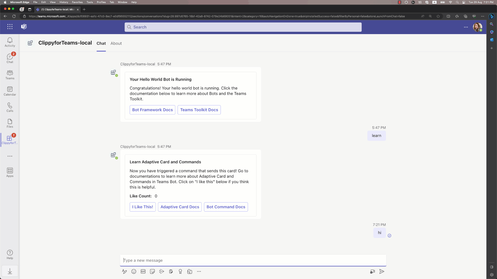

# 📎 Clippy for Teams: Conversational Teams Bot with Teams AI Library

This is a conversational bot for Microsoft Teams that impersonates Clippy that helps people answer questions about Microsoft products. Clippy loves all Microsoft products and is always ready to help users make the most of them. In the project, the bot uses the `gpt-35-turbo-16k` model to chat with Teams users and respond in a polite and respectful manner, staying within the scope of the conversation.

Clippy for Teams bot is built using the Teams Toolkit and Teams AI library, which provides the capabilities to build AI-based Teams applications. 

To learn more about the Teams AI library and build Clippy from scratfch, watch **Clippy for Teams** video in the Doodle to Code series on YouTube:

## Get started with the Clippy for Teams

> **Prerequisites**
>
> To run the Clippy for Teams in your local dev machine, you will need:
>
> - [Node.js](https://nodejs.org/), supported versions: 16, 18
> - A [Microsoft 365 account for development](https://docs.microsoft.com/microsoftteams/platform/toolkit/accounts)
> - [Teams Toolkit Visual Studio Code Extension](https://aka.ms/teams-toolkit) version 5.0.0 and higher or [Teams Toolkit CLI](https://aka.ms/teamsfx-cli)
> - [An Azure OpenAI Service resource](https://learn.microsoft.com/en-us/azure/ai-services/openai/how-to/create-resource?pivots=web-portal#deploy-a-model). 
> *Use `gpt-35-turbo-16k` as the deployment model and define the name of the deployment model as **gpt-35-turbo**.*

1. First, select the Teams Toolkit icon on the left in the VS Code toolbar.
1. In the Account section, sign in with your [Microsoft 365 account](https://docs.microsoft.com/microsoftteams/platform/toolkit/accounts) if you haven't already.
1. In file *env/.env.local.user*, fill in your Azure OpenAI key `SECRET_OPENAI_API_KEY=<your-key>`.
1. In file *env/.env.local*, fill in your Azure OpenAI endpoint `AZURE_OPENAI_ENDPOINT=<your-endpoint>`.
1. Press F5 to start debugging which launches your app in Teams using a web browser. Select `Debug (Edge)` or `Debug (Chrome)`.
1. When Teams launches in the browser, select the Add button in the dialog to install your app to Teams.
1. You will receive a welcome message from the bot, or send any message to get a response.

**Congratulations**! You are running Clippy bot that can now interact with users in Teams.

## What's included in this project?

| Folder       | Contents                                            |
| - | - |
| `.vscode`    | VSCode files for debugging                          |
| `appPackage` | Templates for the Teams application manifest        |
| `env`        | Environment files                                   |
| `infra`      | Templates for provisioning Azure resources          |

The following files can be customized and demonstrate an example implementation to get you started.

| File                                 | Contents                                           |
| - | - |
|`src/index.ts`| Sets up and configures the Clippy Bot.|
|`src/config.ts`| Defines the environment variables.|
|`src/prompts/chat/skprompt.txt`| Defines the prompt.|
|`src/prompts/chat/config.json`| Configures the prompt.|

The following are Teams Toolkit specific project files. You can [visit a complete guide on Github](https://github.com/OfficeDev/TeamsFx/wiki/Teams-Toolkit-Visual-Studio-Code-v5-Guide#overview) to understand how Teams Toolkit works.

| File                                 | Contents                                           |
| - | - |
|`teamsapp.yml`|This is the main Teams Toolkit project file. The project file defines two primary things:  Properties and configuration Stage definitions. |
|`teamsapp.local.yml`|This overrides `teamsapp.yml` with actions that enable local execution and debugging.|

## Extend the Clippy bot with more AI capabilities

You can follow [Get started with Teams AI library](https://learn.microsoft.com/en-us/microsoftteams/platform/bots/how-to/teams%20conversational%20ai/how-conversation-ai-get-started) to extend the AI Chat Bot template with more AI capabilities.

## Additional information and references
- [Teams AI library](https://aka.ms/teams-ai-library)
- [Teams Toolkit Documentations](https://docs.microsoft.com/microsoftteams/platform/toolkit/teams-toolkit-fundamentals)
- [Teams Toolkit CLI](https://docs.microsoft.com/microsoftteams/platform/toolkit/teamsfx-cli)
- [Teams Toolkit Samples](https://github.com/OfficeDev/TeamsFx-Samples)
